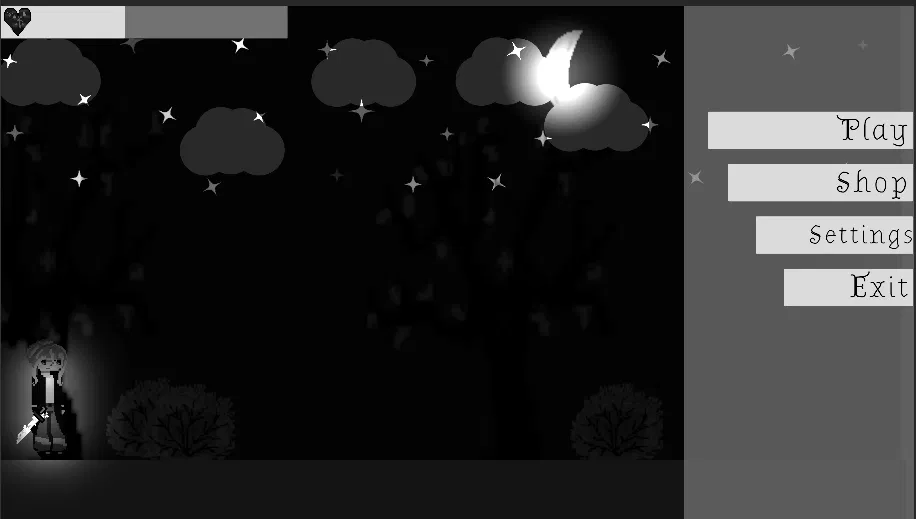
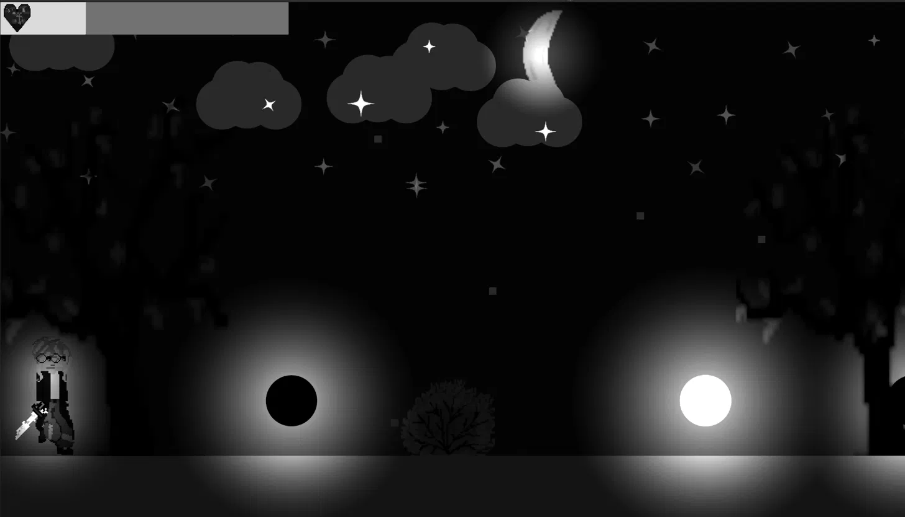
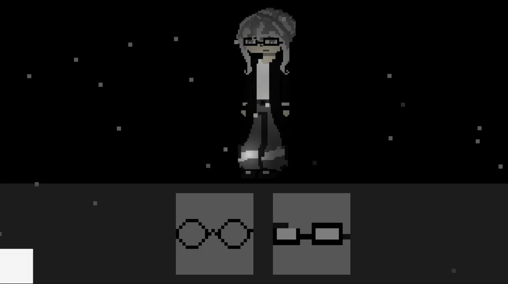
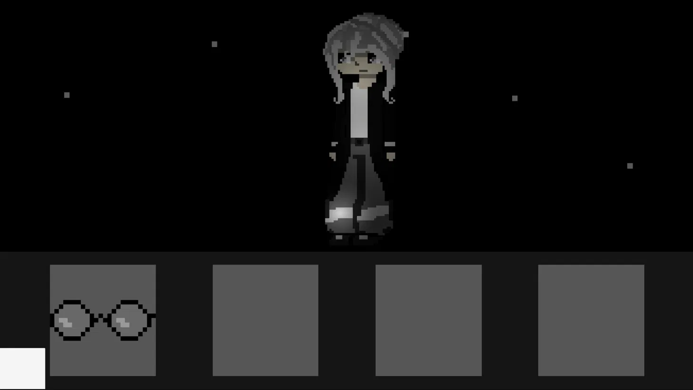

# Night Forest

**Night Forest** is a 2D pixel-art action/survival game built in Unity, set in a dark, atmospheric forest under a glowing moon. The player explores, fights enemies with a sword, earns points, and unlocks cosmetic accessories in the in-game shop.

## ✨ Features

- 🌙 **Atmospheric night forest** — animated moon, drifting clouds, twinkling stars, and a parallax background.
- ⚔️ **Sword combat** — slash attacks with dedicated animations and visual slash effects.
- ❤️ **Health system** — on-screen health bar with damage tint feedback when hit.
- 🏆 **Points / achievements** — a point system tracks player progress via an in-game HUD.
- 🛍️ **Shop & character customization** — unlock and equip cosmetic accessories (e.g. glasses) for your character, with a skin manager and locked/unlocked item states.
- 🎬 **Animated main menu** — Play / Shop / Settings / Exit, with menu button animations and transitions.
- 🕹️ Built with Unity's **New Input System** for player controls.

## 🖼️ Screenshots

| Main Menu | Gameplay |
|---|---|
|  |  |

| Shop (unlocked) | Shop (locked items) |
|---|---|
|  |  |

## 🏗️ Tech Stack

- **Engine:** Unity (2D, Universal Render Pipeline)
- **Language:** C#
- **Systems used:**
  - Unity Input System (new input actions)
  - Cinemachine (camera)
  - TextMesh Pro (UI text)
  - 2D Animation / Sprite tools

## 📂 Project Structure (key scripts)

```
Assets/
├── C#/
│   ├── Player.cs                    # player controller
│   ├── HealthSystem.cs               # health & damage handling
│   ├── DamageTint.cs                 # hit feedback effect
│   ├── KnifeAnimation.cs             # sword/knife attack animation
│   ├── Destroyer.cs                  # object cleanup
│   ├── Object.cs                     # generic game object logic
│   ├── ChangeLevelAnimation.cs       # level/scene transition animation
│   ├── BtnOff.cs                     # UI button state helper
│   │
│   ├── BackGround/
│   │   ├── Objects/MoveObject.cs     # background object movement
│   │   ├── Objects/SpawnObject.cs    # background object spawning
│   │   └── Sparkles.cs               # star/particle sparkle effect
│   │
│   ├── MenuScripts/
│   │   ├── Menu.cs                   # main menu logic
│   │   └── MenuAnimation.cs          # menu button animations
│   │
│   ├── Player Achievement/
│   │   ├── Hud.cs                    # in-game HUD
│   │   └── PointSystem.cs            # score/points tracking
│   │
│   ├── SkinScripts/
│   │   ├── Skin.cs                   # skin data
│   │   ├── SkinManager.cs            # skin unlock/equip logic
│   │   ├── SkinButton.cs             # shop item button
│   │   ├── LoadSkin.cs               # loading equipped skin
│   │   └── accessory.cs              # accessory item logic
│   │
│   └── SpawnScripts/SpawnerTest.cs   # enemy/object spawner
│
├── Animation/                        # animator controllers & clips
├── Image/                            # sprites (player, moon, trees, effects)
├── Prefab/                           # prefabs (lights, effects, environment)
├── Scenes/
│   ├── Main.unity                    # main gameplay scene
│   └── SkinManager.unity             # shop / customization scene
├── Sounds/                           # music & sound effects
├── Fonts/                            # UI fonts
└── TextMesh Pro/                     # TMP resources
```

## 🚀 Getting Started

1. Clone the repository:
   ```bash
   git clone https://github.com/xvt1/NightForest.git
   ```
2. Open the project folder in **Unity Hub** (Unity 6000.x / recent LTS recommended).
3. Open the `Main` scene under `Assets/Scenes/Main.unity`.
4. Press **Play** in the Unity Editor to run the game.

## ⚠️ Project Status

Work in progress — core gameplay, shop, and menu systems are implemented; content and balancing are still evolving.

## 📄 License

This project is licensed under the [Apache License 2.0](LICENSE).
